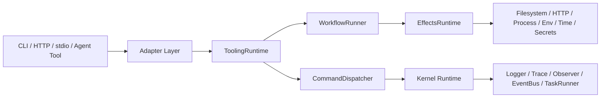

# framework agent tooling runtime vNext 模块设计

## 1. 目标

本文档把 `framework` 的高层方向进一步细化为具体的模块设计，目标是回答下面几个问题：

- `framework` 的未来模块应该如何拆分
- 现有 kernel 能力与新增 tooling/workflow 能力如何组合
- 如何同时支撑 Zig 原生工具、skill backend、workflow CLI 和外部脚本托管
- 如何避免 `framework` 演化成另一个 `zig-opencode`

本文档是 [`agent-tooling-runtime-direction.md`](E:/vscode/fuckcode-dev/framework/docs/architecture/agent-tooling-runtime-direction.md) 的下钻版。

## 2. 设计原则

### 2.1 Kernel 保持通用，不混入 agent 语义

`framework` 的基础 kernel 应继续保持通用，只负责：

- command dispatch
- task lifecycle
- event bus
- observability
- config / validation / error / envelope

不负责：

- session
- prompt
- provider
- model routing
- planner / worker / oracle 等 agent 语义

### 2.2 新能力以“组合层”方式长出，而不是把 AppContext 变成巨型容器

当前 [`runtime/app_context.zig`](E:/vscode/fuckcode-dev/framework/src/runtime/app_context.zig) 已经是一个良好的 kernel 级依赖装配入口。  
未来不建议把所有新能力都直接塞进这一个结构体，而应采用：

- `framework.runtime.AppContext`：kernel 级 context
- `framework.tooling.ToolingRuntime`：tooling 级组合层
- 业务项目自己的 `AppContext`：在 `framework` kernel 之上再装配

这会让边界更清晰。

### 2.3 同一套核心逻辑应支持多入口

未来的核心逻辑应该尽量以统一抽象表达，并同时支持：

- CLI
- HTTP
- stdio tool
- `zig-opencode` builtin tool adapter
- 外部脚本托管

### 2.4 Zig-first，但不是 Zig-only

原生 Zig 工具和 workflow 是一等公民；  
Python / PowerShell / Node 等外部脚本也是重要能力，应被统一托管，而不是被排除在外。

## 3. 建议的整体分层

建议的 vNext 分层如下：

```text
framework
  = kernel
  + effects
  + workflow
  + tooling
  + adapters
```

更具体一点：



## 4. 现有模块如何定位

### 4.1 已存在模块的建议定位

```text
src/core/            = 最基础的错误、校验、日志等通用原语
src/contracts/       = 结构化契约和 envelope
src/config/          = config store / pipeline / side effect
src/observability/   = logger / trace / observer / metrics glue
src/runtime/         = AppContext / TaskRunner / EventBus / capability helpers
src/app/             = command registry / command context / dispatcher
```

这套结构仍然成立，不建议推翻。

### 4.2 现有模块的角色总结

- `core`：最底层通用 primitive
- `runtime`：kernel runtime services
- `app`：结构化 command execution model
- `observability`：横切观测能力
- `config`：结构化配置治理

它们组合起来后，已经足以支撑“小型 deterministic runtime”。

## 5. 建议新增模块

建议新增三个顶层模块：

```text
src/effects/
src/workflow/
src/tooling/
```

### 5.1 `effects/`

职责：

- 对外部世界的访问做统一抽象
- 让 workflow / tool logic 不直接散落依赖 stdlib
- 为测试、审计、权限控制提供统一切入点

建议最小子模块：

```text
src/effects/
├── root.zig
├── fs.zig
├── http_client.zig
├── process_runner.zig
├── env_provider.zig
├── secret_provider.zig
├── temp_workspace.zig
├── clock.zig
└── types.zig
```

建议暴露的 effect 面：

- 文件读写、列目录、移动、删除、原子写
- HTTP GET/POST/stream
- 子进程执行、stdin/stdout/stderr 捕获、timeout、cwd、env
- 环境变量与秘密值读取
- 临时目录 / 临时工作区
- 当前时间 / sleep / monotonic clock

### 5.2 `workflow/`

职责：

- 表达 deterministic workflow
- 运行 workflow definition
- 管理 retry / parallel / wait_event / permission gate 等控制流
- 在需要时将 step 提交到 task runner

建议最小子模块：

```text
src/workflow/
├── root.zig
├── definition.zig
├── step_types.zig
├── runner.zig
├── state.zig
├── checkpoint_store.zig
├── policy.zig
├── hooks.zig
└── builtin_steps.zig
```

建议的最小 step 集合：

- `command`
- `shell`
- `http`
- `branch`
- `parallel`
- `retry`
- `wait_event`
- `ask_permission`
- `ask_question`
- `emit_event`

注意：  
这里的 workflow 是 deterministic orchestration，不是 agent LLM loop。

### 5.3 `tooling/`

职责：

- 把 command / workflow 变成可被消费的 tool
- 托管 Zig 原生工具与外部脚本
- 提供多入口 adapter 的统一注册面

建议最小子模块：

```text
src/tooling/
├── root.zig
├── runtime.zig
├── tool_definition.zig
├── tool_context.zig
├── tool_registry.zig
├── tool_runner.zig
├── script_contract.zig
├── script_host.zig
├── manifest.zig
└── adapters/
    ├── root.zig
    ├── command_surface.zig
    ├── http_surface.zig
    ├── stdio_surface.zig
    └── zig_opencode_surface.zig
```

其核心目标不是再复制一套 command dispatcher，而是在现有 command model 之上提供：

- tool registration
- external tool hosting
- workflow-backed tool execution
- adapter export

## 6. 建议的关键组合关系

### 6.1 `AppContext` 继续做 kernel

继续保留当前 `runtime.AppContext` 的职责：

- logger
- observer
- event bus
- task runner
- command registry
- config store

不建议让它直接膨胀到包含所有 future tool/workflow state。

### 6.2 新增 `ToolingRuntime`

建议新增一个组合层，例如：

```text
ToolingRuntime
  = AppContext kernel
  + EffectsRuntime
  + WorkflowRuntime
  + ToolRegistry
  + ScriptHost
```

这样：

- 小工具项目可直接消费 `ToolingRuntime`
- `zig-opencode` 也可以只挑自己需要的部分接入
- `framework` 不会因为一个 giant AppContext 变得难维护

### 6.3 命令、工具、工作流三者的关系

建议定义如下关系：

```text
Command
  = 单次结构化执行单元

Workflow
  = 多 step 组合执行单元

Tool
  = 对外暴露的消费入口
    底层可映射到 Command 或 Workflow
```

因此：

- 最小工具可以直接映射到一个 `Command`
- 复杂工具可以映射到一个 `Workflow`
- Adapter 层只关心 “怎样调用 Tool”

这会让 skill backend 与 CLI 工具自然统一。

## 7. 外部脚本托管模型

### 7.1 为什么必须有 script host

即便长期方向是 Zig-first，现实里仍然会存在：

- Python 浏览器自动化脚本
- PowerShell 平台胶水脚本
- Node 生态脚本

如果 `framework` 无法托管这些脚本，那么未来 skill backend 仍会分裂成：

- framework-native 工具
- framework 外部零散脚本

这会削弱统一运行时的价值。

### 7.2 建议的 script contract

建议统一采用结构化 stdin/stdout 协议：

- stdin：JSON request
- stdout：JSON result
- stderr：日志或诊断信息
- exit code：成功 / 失败信号

建议脚本 host 能提供：

- cwd
- env 注入
- timeout
- stdout/stderr capture
- result_json 验证
- 统一错误映射
- 统一事件与日志

### 7.3 建议的脚本工具类型

建议将外部脚本至少分为三类：

- `native_zig`
- `external_json_stdio`
- `external_passthrough`

其中 `external_json_stdio` 最适合 skill backend。

## 8. Adapter 设计建议

未来 adapter 层建议只做协议转换，不直接承载业务语义。

建议至少支持：

### 8.1 `command_surface`

把 tool 暴露为统一 command method，便于 CLI / HTTP / test 直接走 dispatcher。

### 8.2 `http_surface`

把 tool / workflow 暴露为结构化 HTTP API。

### 8.3 `stdio_surface`

把 tool / workflow 暴露为 stdio 协议，便于：

- agent tool host
- 本地子进程集成
- 未来 MCP / bridge 风格封装

### 8.4 `zig_opencode_surface`

把 `framework` 中的 tool / workflow 包装成 `zig-opencode` 内部可消费的 builtin tool。

这是未来复用价值最高的一层之一。

## 9. 依赖规则建议

为避免模块互相侵蚀，建议明确以下依赖规则：

### 9.1 允许的依赖方向

```text
core -> nobody
contracts -> core
config -> core / contracts / observability / runtime
observability -> core / contracts
runtime -> core / contracts / observability
app -> core / contracts / runtime / observability
effects -> core / contracts / runtime / observability
workflow -> core / contracts / runtime / observability / app / effects
tooling -> core / contracts / runtime / observability / app / effects / workflow
```

### 9.2 禁止的方向

- `core` 不能依赖 `tooling`
- `runtime` 不能依赖 `zig-opencode`
- `workflow` 不应感知 LLM/session 语义
- `tooling` 不应直接 hardcode 某个具体产品的 UI 逻辑

## 10. 参考使用方式

### 10.1 小型 Zig CLI

```text
CLI
  -> command_surface
  -> ToolingRuntime
  -> Command or Workflow
  -> EffectsRuntime
```

### 10.2 Skill backend

```text
Agent Tool
  -> stdio_surface
  -> ToolingRuntime
  -> external_json_stdio script or native Zig tool
  -> structured result
```

### 10.3 `zig-opencode` 内部复用

```text
zig-opencode builtin tool
  -> zig_opencode_surface
  -> ToolingRuntime
  -> WorkflowRunner / ScriptHost / EffectsRuntime
```

## 11. 最小可行目录蓝图

建议的 vNext 目录蓝图如下：

```text
src/
├── app/
├── config/
├── contracts/
├── core/
├── observability/
├── runtime/
├── effects/
│   ├── root.zig
│   ├── fs.zig
│   ├── http_client.zig
│   ├── process_runner.zig
│   ├── env_provider.zig
│   ├── secret_provider.zig
│   ├── temp_workspace.zig
│   ├── clock.zig
│   └── types.zig
├── workflow/
│   ├── root.zig
│   ├── definition.zig
│   ├── step_types.zig
│   ├── runner.zig
│   ├── state.zig
│   ├── checkpoint_store.zig
│   ├── policy.zig
│   └── builtin_steps.zig
└── tooling/
    ├── root.zig
    ├── runtime.zig
    ├── tool_definition.zig
    ├── tool_context.zig
    ├── tool_registry.zig
    ├── tool_runner.zig
    ├── script_contract.zig
    ├── script_host.zig
    ├── manifest.zig
    └── adapters/
        ├── root.zig
        ├── command_surface.zig
        ├── http_surface.zig
        ├── stdio_surface.zig
        └── zig_opencode_surface.zig
```

## 12. 一个最重要的设计判断

如果只保留一个设计判断，我会建议保留这一条：

> 未来 `framework` 的关键不是把 AI 语义下沉，而是把 “effect + workflow + tool host + adapters” 做实。

只要这四层做实：

- Zig 原生工具能快速长出来
- skill backend 能被统一托管
- CLI 与 tool 不再分裂
- `zig-opencode` 也能反向复用这些能力

这将使 `framework` 成为真正的长期资产，而不是某个单一产品的附属模块。
