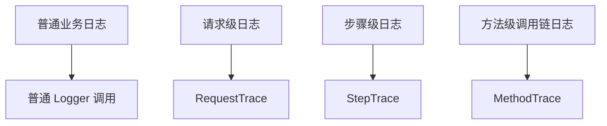

# framework 日志与调用链追踪设计

## 1. 文档定位

这份文档只保留 **长期有效的设计信息**，不再混入“某一轮升级计划是否完成”的过程性信息。

它回答的是：

- `framework` 的日志系统应该怎么组织
- `request_trace / step_trace / method_trace` 分别承担什么职责
- 为什么要向 Rust `tracing` 和 `SmartFramework.backend` 的调用链语义靠拢
- `ourclaw` 与 `ourclaw-manager` 应该怎么消费这套日志能力

如果你想看“怎么用”，请看：

- `framework/docs/architecture/logging-usage-guide.md`

## 2. 设计目标

`framework` 的日志体系应同时满足三类目标：

1. **结构化**
   - 所有日志都先落成 `LogRecord`
   - 统一支持字段、级别、子系统、trace 上下文

2. **可追踪**
   - 请求级日志可以看到：
     - `trace_id`
     - `request_id`
     - `method`
     - `path`
     - `status`
     - `duration_ms`
   - 多层步骤/方法日志可以与同一请求关联

3. **可诊断**
   - 普通状态变化能看懂
   - 关键步骤耗时能看懂
   - 完整调用链能看懂

## 3. 参考设计意图

### 3.1 Rust `tracing` 的参考价值

Rust 侧真正值得借鉴的不是某个漂亮输出，而是三层分工：

- **入口 subscriber 装配**：全局格式、级别、输出层
- **request middleware**：请求 started/completed 与 request span
- **方法级 trace logger**：方法耗时、阈值、异常分类

设计意图：

> 请求生命周期、方法级耗时、普通业务日志三者分层组织，而不是全挤在一层里。

### 3.2 `SmartFramework.backend` 的参考价值

`SmartFramework.backend` 的关键参考点在于：

- `TraceManager` 负责上下文传播
- `TraceInterceptorBase` 负责 `ENTRY / EXIT / ERROR`
- `SimpleTraceLogger` 负责摘要型调用链输出

设计意图：

> 同一个 `TraceId` 必须贯穿整条调用链，而且“谁负责渲染 TraceId”要非常单一，避免重复。

## 4. 核心设计原则

### 4.1 单一事实源

`trace_id / request_id / span_id` 的唯一事实源应是：

- `LogRecord` 顶层上下文
- 或当前 trace scope

不应再把这些字段重复塞进 `fields` 里。

### 4.2 分层日志模型

日志应分成三层：



#### 普通日志
- 用于状态变化和业务事实
- 不负责生命周期追踪

#### RequestTrace
- 负责 request started/completed
- 负责请求级 `trace_id/request_id/method/path/status/duration_ms`

#### StepTrace
- 负责单步骤耗时
- 适合配置写入、副作用、provider 调用、节点探测等“子步骤”

#### MethodTrace
- 负责完整调用链的 `ENTRY / EXIT / ERROR`
- 更接近 `SmartFramework.backend` 风格
- 适合 handler / service / usecase / dispatcher 级别

### 4.3 上下文传播优先于手工传参

如果要做到“多层日志共享同一个请求 `trace_id`”，正确的做法不是每一层手工传 `trace_id`，而是：

- request 进入时建立 trace scope
- logger 自动从当前 scope 读取上下文
- `StepTrace / MethodTrace` 自动继承

### 4.4 渲染职责单一

`request` 和 `method` 这种有专门 pretty 形态的日志，不应再重复走通用 `appendContext()` 把同样的信息再打一遍。

设计原则是：

- request 头部负责 request 关键信息
- method 头部负责方法关键信息
- 尾部只补剩余字段

## 5. 数据模型设计

### 5.1 LogRecord

核心字段：

- `ts_unix_ms`
- `level`
- `subsystem`
- `message`
- `trace_id`
- `span_id`
- `request_id`
- `error_code`
- `duration_ms`
- `fields`

约束：

- `trace_id/request_id/span_id` 放在顶层
- `fields` 只放业务字段或步骤字段

### 5.2 RequestTrace 字段

固定语义：

- `trace_id`
- `request_id`
- `source`
- `method`
- `path`
- `query`
- `status`
- `duration_ms`

### 5.3 StepTrace 字段

固定语义：

- `step`
- `duration_ms`
- `threshold_ms`
- `beyond_threshold`
- `error_code`

### 5.4 MethodTrace 字段

固定语义：

- `method`
- `params`
- `result`
- `status`
- `duration_ms`
- `type`
- `threshold_ms`
- `beyond_threshold`
- `error_code` / `exception_type`

## 6. 渲染设计

### 6.1 Pretty Console

#### 普通日志

```text
2026-03-17T10:00:00.123Z  INFO config/write: config written path="gateway.port"
```

#### RequestTrace

```text
2026-03-17T10:00:00.123Z  INFO request{trace_id=... request_id=... method=GET path=/health query=None}: Request completed status=200 duration_ms=4
```

#### StepTrace

```text
2026-03-17T10:00:00.123Z  WARN runtime/provider{step=request}: Step completed duration_ms=31 beyond_threshold=true threshold_ms=10 error_code="PROVIDER_TIMEOUT"
```

#### MethodTrace

```text
2026-03-17T10:00:00.123Z DEBUG TraceId:...|ENTRY|Controller.Auth.Login params="{...}" threshold_ms=500
2026-03-17T10:00:00.456Z  INFO TraceId:...|EXIT|Controller.Auth.Login result="Ok(200)" status="SUCCESS" duration_ms=333 type="SYNC" beyond_threshold=false threshold_ms=500
```

### 6.2 JSON / Compact

JSON 与 compact 仍应保留结构化消费友好性，不能为了接近 Rust 文字样式而损失可消费能力。

## 7. 默认运行态装配

默认策略：

- 总是保留 `MemorySink`
- 非测试环境默认附加 `ConsoleSink.pretty`
- 可选附加 `JsonlFileSink`
- 由 `MultiSink` 扇出

## 8. 与 `ourclaw` / `ourclaw-manager` 的关系

### 8.1 `ourclaw`

`ourclaw` 应优先接入：

- HTTP / bridge / CLI 入口的 `RequestTrace`
- control-plane 关键入口的 `StepTrace`
- 调度链/handler 链的 `MethodTrace`

### 8.2 `ourclaw-manager`

`ourclaw-manager` 当前更适合：

- 消费 runtime 已暴露的日志/状态/事件面
- 而不是自己重复实现一套 runtime trace 体系

## 9. 演进原则

后续如果继续增强，应遵守：

1. 不重写 `Logger -> LogRecord -> Sink`
2. 优先增强 middleware / helper / renderer / 装配
3. 所有 trace 相关字段只保留单一事实源
4. 文档、渲染、测试要一起同步

## 10. 一句话结论

`framework` 的日志系统不该只追求“像 Rust 那样好看”，而应该追求：

> 在保持结构化和低侵入的前提下，把请求级、步骤级、方法级日志组织成一条完整、可追踪、可诊断的调用链。
