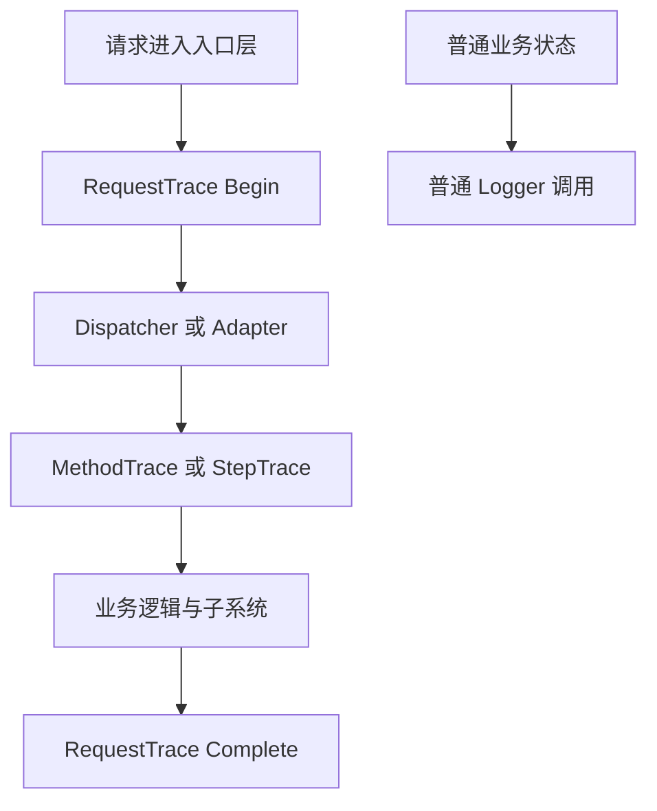
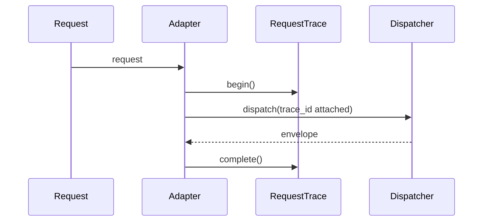
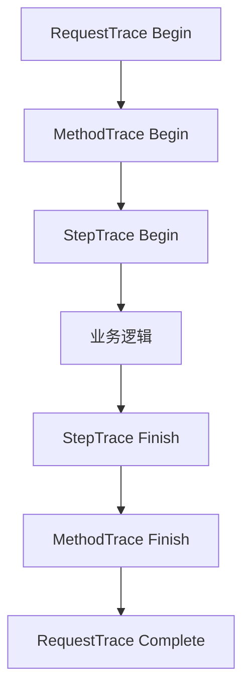
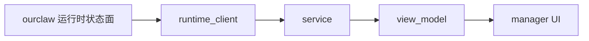

# 日志组件使用指南

## 1. 文档目的

这份文档面向工作区开发者，说明如何**正确使用 `framework` 的日志组件**，让系统日志：

- 更容易追踪请求
- 更容易定位系统问题
- 更容易关联完整调用链
- 更适合 `ourclaw` 与 `ourclaw-manager` 的长期产品化演进

本指南不是日志底层设计文档。底层设计与升级路线请看：

- `framework/docs/architecture/logging.md`
- `framework/docs/architecture/logging-tracing-design.md`

这份文档的目标是告诉你：

> 在实际开发里，应该怎么打日志、在哪一层打日志、哪些地方不应该乱打日志。

---

## 2. 先记住四种日志能力

当前 `framework` 里最重要的四类日志能力是：

1. **普通结构化日志**
2. **请求级 trace 日志**
3. **步骤级 / 方法级 trace 日志**
4. **摘要级 trace 日志**

如果只记一句话：

- 普通日志：记录业务状态
- request trace：记录请求生命周期
- step/method trace：记录关键步骤和完整调用链
- summary trace：记录适合 grep / 统计 / 慢调用筛选的摘要结果

---

## 3. 整体使用分层



要点：

- 请求入口优先包 `request_trace`
- 关键步骤优先包 `StepTrace`
- 完整调用链/方法入口优先包 `MethodTrace`
- 摘要结果优先包 `SummaryTrace`
- 普通状态信息走 `logger.child(...).info(...)`

---

## 4. 在 `framework` 里怎么用

### 4.1 普通结构化日志

最常见的用法是：

```zig
logger.child("config").child("write").info("config written", &. {
    framework.LogField.string("path", change.path),
    framework.LogField.boolean("requires_restart", attempt.requiresRestart()),
});
```

适合场景：

- 状态变化
- 成功/失败结果
- 配置写入
- provider/model 选择
- 生命周期状态变更

### 4.2 `request_trace`

适合：

- HTTP
- bridge
- CLI 请求入口

示例：

```zig
var trace = try framework.observability.request_trace.begin(
    allocator,
    app.framework_context.logger,
    .http,
    request.request_id,
    method,
    request.route,
    null,
);
defer trace.deinit();

const envelope = try dispatcher.dispatch(.{
    .request_id = request.request_id,
    .method = method,
    .params = request.params,
    .source = .http,
    .trace_id = trace.trace_id,
    .authority = request.authority,
}, false);

framework.observability.request_trace.complete(
    app.framework_context.logger,
    &trace,
    statusCodeForEnvelope(envelope),
    if (!envelope.ok and envelope.app_error != null) envelope.app_error.?.code else null,
);
```

你不需要手工打：

- `Request started`
- `Request completed`
- `trace_id`
- `duration_ms`

这些都应该让 `request_trace` 自动生成。

### 4.3 `StepTrace`

适合：

- 一个步骤是否超阈值
- 一个步骤是否失败
- 需要看步骤耗时，但还不需要完整调用链

示例：

```zig
var trace = try framework.StepTrace.begin(
    allocator,
    app.framework_context.logger,
    "gateway/remote",
    "enable",
    1000,
);
defer trace.deinit();

// 执行业务逻辑
trace.finish(null);
```

有错误时：

```zig
trace.finish("REMOTE_DISABLED_BY_POLICY");
```

### 4.4 `MethodTrace`

适合：

- 需要清楚表达 `ENTRY / EXIT / ERROR`
- 想更像完整调用链日志
- 需要记录 `Result / Status / Duration / Type`

示例：

```zig
var method_trace = try framework.MethodTrace.begin(
    allocator,
    ctx.logger.logger,
    "Controller.Auth.Login",
    "{\"userName\":\"admin\",\"password\":\"***\"}",
    500,
);
defer method_trace.deinit();

method_trace.finishSuccess("Ok(200)", false);
```

错误时：

```zig
method_trace.finishError("UnauthorizedAccessException", "AUTH_FAILED", false);
```

### 4.5 `SummaryTrace`

适合：

- 输出 `ME / RT / BT / ET` 风格的摘要日志
- 对某个方法/动作给出一条适合 grep、统计和阈值筛选的总结
- 与 `MethodTrace` 配合使用：前者看完整链路，后者看摘要结论

示例：

```zig
var summary_trace = try framework.SummaryTrace.begin(
    allocator,
    ctx.logger.logger,
    "Controller.Auth.Login",
    500,
);
defer summary_trace.deinit();

summary_trace.finishSuccess();
```

错误时：

```zig
summary_trace.finishError(.validation);
summary_trace.finishError(.business);
summary_trace.finishError(.auth);
summary_trace.finishError(.system);
```

字段语义：

- `ME`：Method
- `RT`：Run Time，总执行时间，单位毫秒
- `BT`：Beyond Threshold，是否超过阈值，`Y / N`
- `ET`：Exception Type 分类码

`ET` 当前约定：

- `N`：无异常
- `V`：验证异常
- `B`：业务异常
- `A`：认证/授权异常
- `S`：系统异常

典型输出：

```text
[08:23:02 INF] TraceId:xxxx|ME:OpenSpecZig.Status|RT:3|BT:N|ET:N
```

### 4.6 文件输出策略

当前 `framework` 在文件日志上有两条路线：

- `TraceTextFileSink`
  - 适合本地调试、人工排查、grep 调用链
  - 更适合看 `TraceId / ENTRY / EXIT / ME / RT / BT / ET`
- `JsonlFileSink`
  - 适合机器采集、日志平台接入、后处理分析
  - 更适合结构化检索和外部日志系统

推荐默认：

- 面向开发者调试：优先 `TraceTextFileSink`
- 面向机器消费：优先 `JsonlFileSink`

参考示例：

- `framework/examples/logging_method_trace_demo.zig`
- `framework/examples/logging_summary_trace_demo.zig`

---

## 5. 在 `ourclaw` 里怎么用

### 5.1 HTTP / bridge / CLI 入口

当前 `ourclaw` 已经把 `request_trace` 接到了：

- `ourclaw/src/interfaces/http_adapter.zig`
- `ourclaw/src/interfaces/bridge_adapter.zig`
- `ourclaw/src/interfaces/cli_adapter.zig`

所以这里的原则是：

> 不要重复手工打请求开始/结束日志，优先复用 `request_trace`。

### 5.2 控制面步骤

当前这些入口已经接了 `StepTrace`：

- `onboard.apply-defaults`
- `diagnostics.remediate_*`
- `gateway.remote.enable/disable`
- `config_runtime_hooks`
- `node.invoke`

也就是说，如果你继续给类似控制面命令加步骤日志，优先沿用这个模式。

### 5.3 哪些地方应该用 `MethodTrace`

如果你想要更像 `SmartFramework.backend` 那种完整调用链日志，建议优先在下面这些地方使用 `MethodTrace`：

- `CommandDispatcher` 主执行链
- 未来的 handler/usecase 层
- provider request 封装层
- node/device action 层

原则是：

- **入口/边界层**：适合 `MethodTrace`
- **步骤/子动作层**：适合 `StepTrace`
- **摘要/统计层**：适合 `SummaryTrace`

### 5.4 真实示例：配置运行时钩子

```zig
var trace = try framework.StepTrace.begin(
    self.allocator,
    self.logger,
    "config/side_effect",
    change.path,
    250,
);
defer trace.deinit();

// 执行副作用
trace.finish(null);
```

### 5.5 真实示例：节点安全动作

```zig
var trace = try framework.StepTrace.begin(
    ctx.allocator,
    app.framework_context.logger,
    "node/invoke",
    action,
    500,
);
defer trace.deinit();

// probe / health_check
trace.finish(null);
```

---

## 6. 在 `ourclaw-manager` 里怎么用

`ourclaw-manager` 当前主线**不是自己直接搭一套日志调用链**，而是：

- 通过 `runtime_client`
- 读取 `status/logs/events/diagnostics`
- 消费 `ourclaw` 暴露出来的 runtime surface

所以在 manager 里，优先级是：

1. 先消费 runtime 的日志/状态面
2. 再在 manager 自己的 view model / host 层补少量本地日志

换句话说：

> manager 当前更像日志消费者，而不是日志主系统。

### 推荐方式

- 状态页：读 `status.*`
- 诊断页：读 `diagnostics.*`
- 日志页：读 `logs.recent`
- 事件页：读 `events.poll`

而不是直接在 manager 里重新组织一套和 runtime 平行的 trace 体系。

---

## 7. 如何让日志更容易追踪问题

### 7.1 统一命名

子系统路径要稳定，例如：

- `config/write`
- `config/side_effect`
- `gateway/remote`
- `node/invoke`
- `providers/openai`

方法级名称也要稳定，例如：

- `Controller.Auth.Login`
- `Repository.UserRepository.GetByLoginIdAsync`

### 7.2 不要把关键字段塞进 message

错误示例：

```zig
logger.info("gateway port changed to 8787 and restart required", &.{});
```

正确示例：

```zig
logger.info("gateway config updated", &. {
    framework.LogField.string("path", "gateway.port"),
    framework.LogField.uint("port", 8787),
    framework.LogField.boolean("requires_restart", true),
});
```

### 7.3 请求级和方法级不要混着用

错误做法：

- 在 handler 里自己再手工打一遍 `Request started`

正确做法：

- 请求级：交给 `request_trace`
- 方法级：交给 `MethodTrace`
- 步骤级：交给 `StepTrace`

### 7.4 不要把敏感字段放进非敏感 key

脱敏是按 key 名匹配的。

也就是说：

- `password`
- `token`
- `secret`
- `authorization`

这种 key 会被遮蔽；
但如果你把密码塞到 `payload` 这种普通 key 里，系统不会自动识别它是敏感信息。

### 7.5 把 trace 贯穿，而不是只在入口打一次

如果你只在入口打 `request_trace`，但下游全是普通 `logger.info()`，那链路仍然不完整。

推荐做法：

- 入口：`request_trace`
- 关键方法：`MethodTrace`
- 关键步骤：`StepTrace`

这样才能真正看出：

- 谁调用了谁
- 哪一层最慢
- 哪一层失败
- 同一个请求里的多层日志属于同一个 `trace_id`

---

## 8. 推荐使用套路

### 模式 A：适配器入口



### 模式 B：控制面命令



### 模式 C：manager 读取 runtime 日志面



---

## 9. 推荐代码片段

### 入口层模板

```zig
var trace = try framework.observability.request_trace.begin(
    allocator,
    app.framework_context.logger,
    .http,
    request.request_id,
    method,
    request.route,
    null,
);
defer trace.deinit();

const envelope = try dispatcher.dispatch(.{
    .request_id = request.request_id,
    .method = method,
    .params = request.params,
    .source = .http,
    .trace_id = trace.trace_id,
    .authority = request.authority,
}, false);

framework.observability.request_trace.complete(
    app.framework_context.logger,
    &trace,
    statusCodeForEnvelope(envelope),
    if (!envelope.ok and envelope.app_error != null) envelope.app_error.?.code else null,
);
```

### 方法级模板

```zig
var method_trace = try framework.MethodTrace.begin(
    allocator,
    ctx.logger.logger,
    "Controller.Auth.Login",
    "{\"userName\":\"admin\",\"password\":\"***\"}",
    500,
);
defer method_trace.deinit();

method_trace.finishSuccess("Ok(200)", false);
```

### 摘要级模板

```zig
var summary_trace = try framework.SummaryTrace.begin(
    allocator,
    ctx.logger.logger,
    "Controller.Auth.Login",
    500,
);
defer summary_trace.deinit();

summary_trace.finishSuccess();
```

### 步骤级模板

```zig
var step_trace = try framework.StepTrace.begin(
    allocator,
    app.framework_context.logger,
    "gateway/remote",
    "enable",
    1000,
);
defer step_trace.deinit();

step_trace.finish(null);
```

---

## 10. 一句话建议

如果你只记住一句话，那就是：

> **入口用 `request_trace`，关键方法用 `MethodTrace`，关键步骤用 `StepTrace`，摘要结果用 `SummaryTrace`，普通状态变化用 `logger.child(...).info(...)`。**

按这个方式用，日志就会更容易：

- 找请求
- 查链路
- 看耗时
- 定位故障

而不会变成一堆只适合人眼扫、却很难回溯系统问题的散乱文本。
